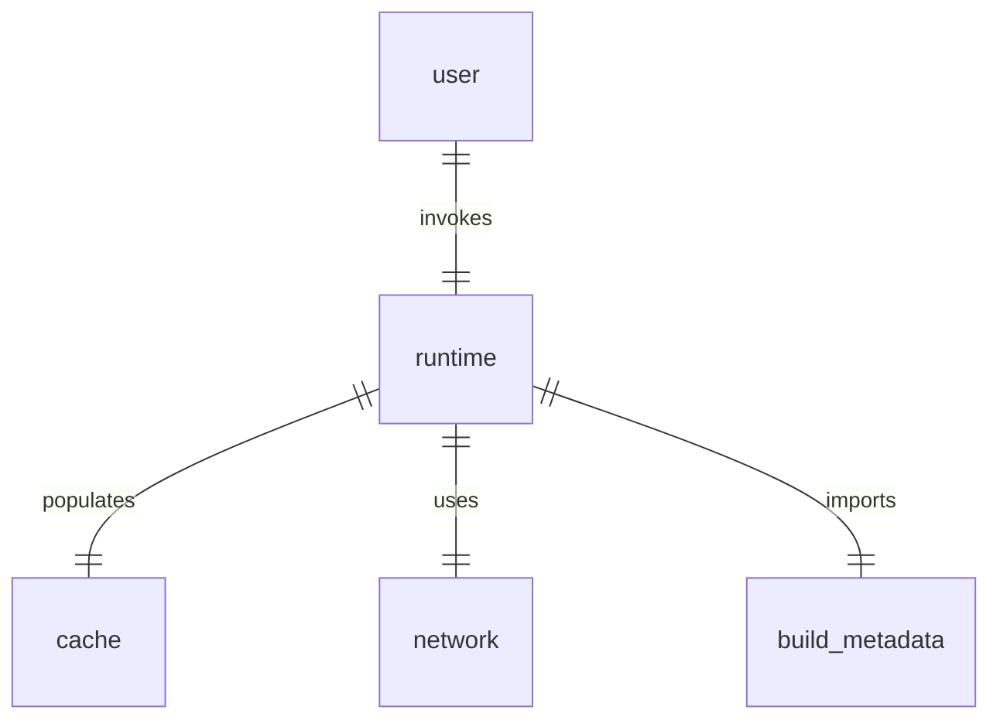

# @data-eden/athena

TODO: writeme
  * re-render after merging entities
  * buildAthena options (e.g. cache)
  * execute options e.g.
    * freshness/staleness for request
    * ttl &c. for this particular data
    * cache overrides, e.g. merge strategy overrides
  * $debug?
    - calltree
  * populating cache.$debug
    - stacktrace of network call sites (1:revision, n:merged models)


Athena has two components:
* a build tool
* a runtime library

## System Components




## Build Tool

The build tool compiles graphql documents into opaque objects with associated metadata that can be passed around in usercode to runtime APIs

TODO: writeme

### Query Metadata

- **Paths of referenced entities** In order to correctly distinguish cache entries like 'urn:author:1' as either strings or references. More advanced cases to handle:
  - arrays of references
  - graphql unions (mandate/include `__typename`) with fragments that have type conditions
  - arrays of graphql unions
  - ?? non-union cases with fragments with type conditions (e.g. for interfaces)

Consider e.g.

```graphql
{
  foo {
    bar {
      __typename

      ... on TypeA {
        a
        b
        c
      }

      ... on TypeB {
        d
        e
        f
      }
    }
  }
}
```

- **Unconventional ID Field Names** In order to identify whether an object should be a cached entity we need to know what the `ID` field is. We only need to stash extra information for unconventional names (e.g. if the whole API always uses `id` or `urn` then we don't need to copy that data).
- **$!prod.fields** Field masking during non-production environments.
